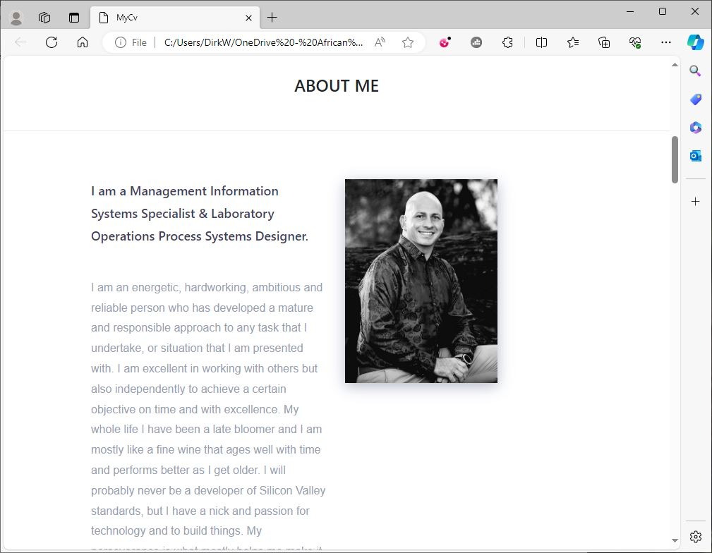
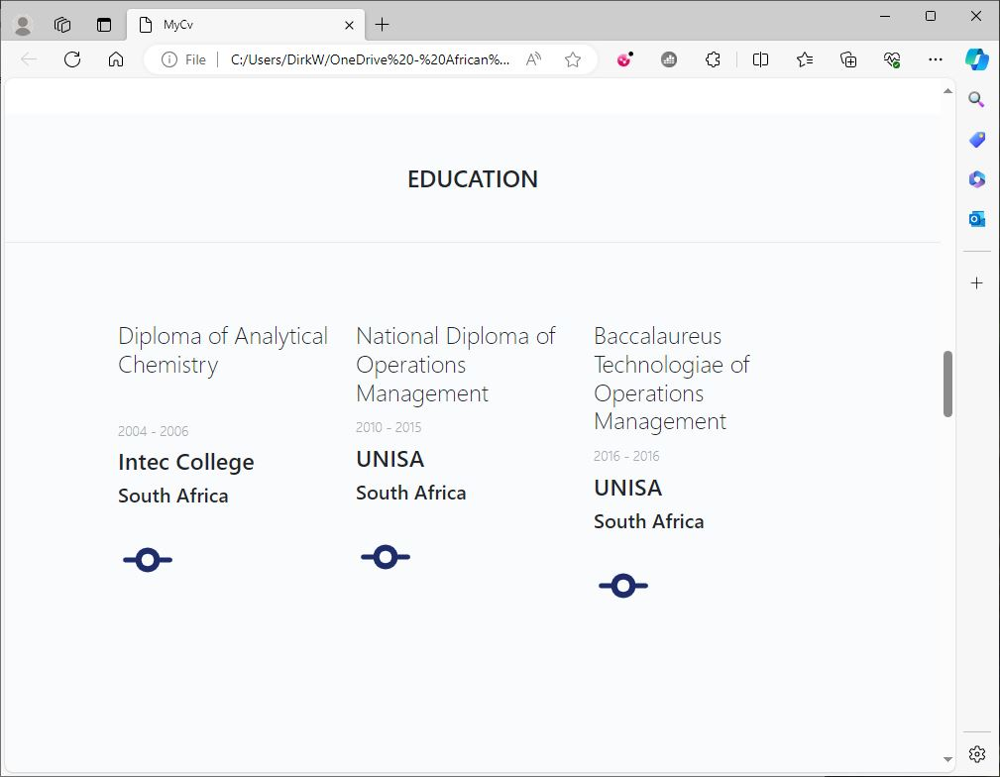
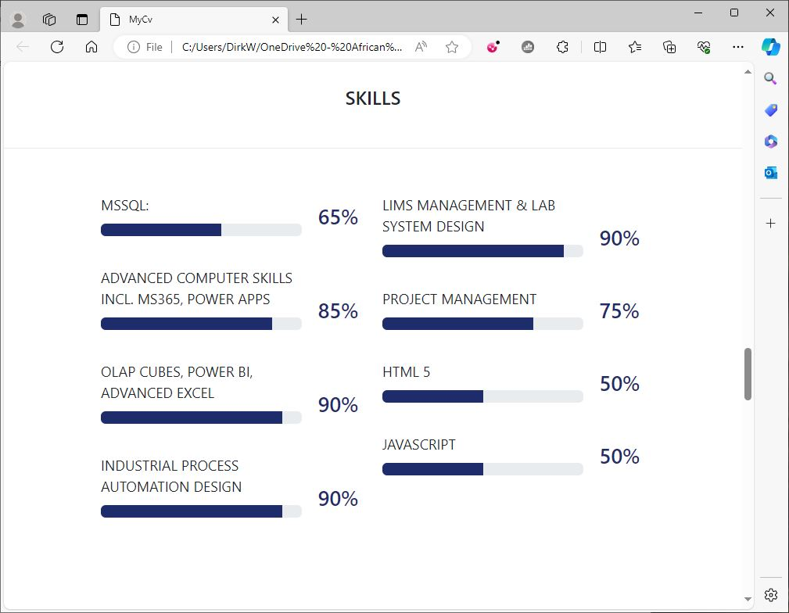
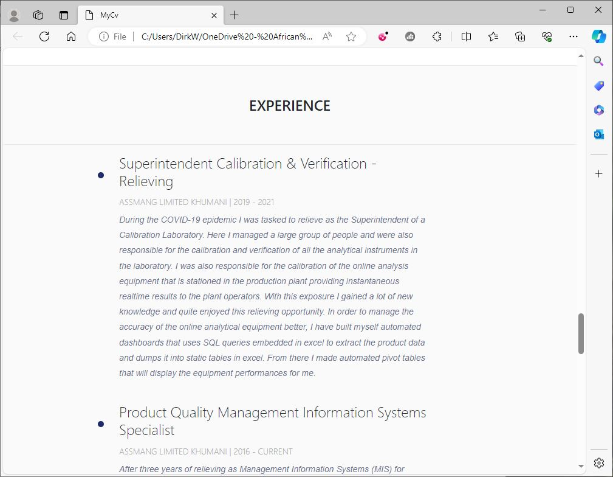

# My Online CV

## My personal online CV created in the form of a webpage. 

### Intro:
As a capstone project we had to build a personal webpage that functions as an online CV and developer portfolio that can be updated with time. As your portfolio grows and you reach more milestones and complete more projects, you can update the CV and share it on github. Here, you must tell the world a bit about yourself, your background, education, and experience. 

#### How the webpage works:
* The webpage will launch from a simple html file named index.html
* The page will open with a landing image of my family with a welcome message.
* Then you can scroll down through the webpage from top to bottom and read through all the different sections of the page listed in order.
* The page is made up of different sections in the form of a block that contains information about that section all under the header.
* They are listed as follows:
    - Landing image and welcome message
    - About Me section: Details about me, my dreams, passion, contact details and an image of me.
    - Education: Education name, where obtained from and the year. Each of the eductions are separated with columns and the details stacked vertically.
    - Skills: The skills section is made up with a progress bar and a percentage indicator to rate my skills level at each topic. The progress bar animations run from js code in a separate file. As the page open or refresh, the bars will fill to the set values.
    - Experience: The experience section is made up from a list. Each list section contain a header of the name of the position occupied, the timeline in that position, and a paragraph summary of what I did during that position.

##### Installation & Usage works:
This is a html webpage file and does not require a formal installation process. But the guide below will explain how to make sure you can launch and view the webpage.
1. Clone the repository: MyCV to your local machine.
2. Make sure you download the two folders: images and styling to a directory of your choice.
3. Download the index.html file and place it the the root where the images and styleing folders are.
4. Note that the index.html file, images folder and styling folder should all be on the same level.
5. Now you can open the index.html file with any browser like Edge or Chrome.

  

